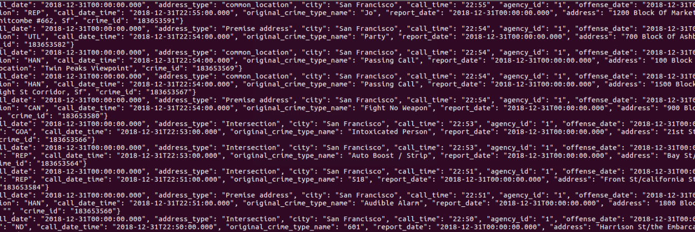
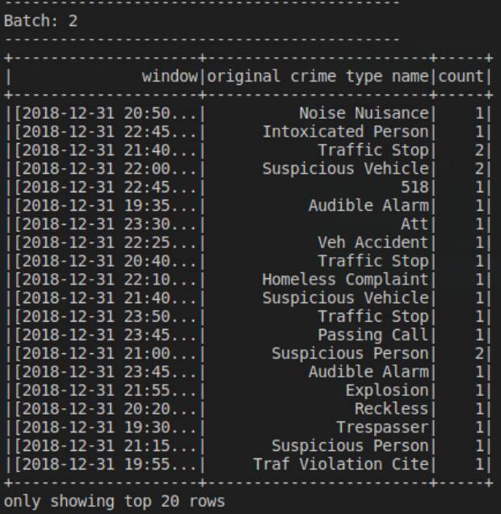

# SF Crime Statistics with Spark Streaming

### Development Environment

You may choose to create your project in the workspace we provide here, or if you wish to develop your project locally, you will need to set up your environment properly as described below:
```
Spark 2.4.3
Scala 2.11.x
Java 1.8.x
Kafka build with Scala 2.11.x
Python 3.6.x or 3.7.x
```

### Environment Setup:

Download Spark from `https://spark.apache.org/downloads.html.` Choose Prebuilt for Apache Hadoop 2.7 and later
Unpack Spark in one of your folders (I usually put all my dev requirements in /home/users/user/dev)
Download Scala from the official site or for Mac users, you can also use brew install scala but make sure you download version 2.11.x
Run below to verify correct versions
```
java -version
scala -version
```

## Running the Project
This project requires creating topics, starting Zookeeper and Kafka server, and your Kafka bootstrap server. Use the commands below to start Zookeeper and Kafka server.

```
bin/zookeeper-server-start.sh config/zookeeper.properties
bin/kafka-server-start.sh config/server.properties
```
You can start the server using this Python command:

`python producer_server.py` and then `bin/kafka-console-consumer.sh --bootstrap-server localhost:9092 --topic <your-topic-name> --from-beginning`

This what I obtained 


To stream the data , I used the following command `spark-submit --packages org.apache.spark:spark-sql-kafka-0-10_2.11:2.3.0 --master local[4] data_stream.py`

And this is what I obtained


